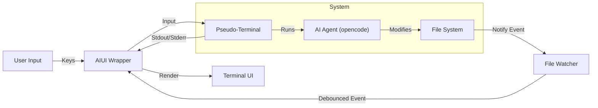

# AI-TUI: Terminal Control Layer for AI Agents

**AIUI** is a terminal-native wrapper designed to give developers visibility and control over AI coding agents. It runs existing CLI tools (like `opencode-ai`) inside a pseudo-terminal (PTY) while providing a real-time side-by-side view of the file system changes happening in your project.


## Visual Sample


> [!NOTE]
> This project is currently in the **starting stage** of development. The actual cli support with all the agents will be launched soon !


##  Key Features

-  Native PTY Integration: Runs interactive shells and AI CLIs directly. Supports `bash`, `zsh`, `cmd`, and standard input/output.
-  Real-Time File Monitoring: Automatically detects and displays file changes (`+ Created`, `~ Modified`, `- Deleted`) as the AI works.
-  Smart Noise Filtering:
  - Ignores internal metadata changes, `.git` operations, and temporary build artifacts (`target/`).
  - Debouncing: Collapses rapid-fire events into single clean notifications.
-  Split-Pane TUI: Built with [Ratatui](https://github.com/ratatui-org/ratatui) for a premium, flicker-free terminal experience.
-  Written in Rust: Fast, memory-safe, and cross-platform (Windows/WSL support optimized).

##  Tech Stack

- **Language**: Rust
- **UI Framework**: [Ratatui](https://ratatui.rs/) + [Crossterm](https://github.com/crossterm-rs/crossterm)
- **Terminal Emulation**: [portable-pty](https://github.com/wez/wezterm/tree/main/portable-pty) + [vt100](https://github.com/doy/vt100)
- **File Watching**: [notify](https://github.com/notify-rs/notify)

##  Installation & Usage

### Prerequisites
- Rust (latest stable)
- Node.js/npm (if running `opencode-ai`)

### Running the App

```bash
# Clone the repository
git clone https://github.com/yourusername/aiui.git
cd aiui

# Run with Cargo
cargo run
```

By default, the application is configured to launch `npx opencode-ai` in a `bash` shell. You can modify `src/main.rs` to run any other command (like `cmd`, `zsh`, or `claude`).

##  Controls

| Key Binding | Action |
|-------------|--------|
| `Ctrl + Q`  | Exit the application (Standard `q` is forwarded to shell) |
| `Ctrl + C`  | Forward `SIGINT` to the running process |
| `Ctrl + D`  | Forward `EOF` to the running process |
| `Standard`  | All other keys are forwarded to the internal shell |


##  Architecture

AIUI acts as a "Man-in-the-Middle" between you and the AI CLI:



